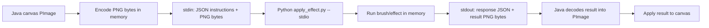

# In-memory stroke transport

This change removes the per-stroke image files from the Java/Python effect path.
Instead of saving a stroke input PNG and later reading a stroke output PNG, Java
sends the canvas image to Python through stdin and receives the processed result
through stdout.

The transport is a small length-prefixed binary protocol:

```text
Java -> Python stdin:
[4-byte JSON length][JSON instructions][4-byte PNG length][PNG bytes]

Python -> Java stdout:
[4-byte JSON length][JSON response][4-byte PNG length][PNG bytes]
```

`stdout` is reserved for the binary response. Logs and debug output are routed to
`stderr`, so debug prints cannot corrupt the image response.



The persistent stroke JSON stays lightweight and still stores the brush, user
parameters, and path data. Legacy file-based stroke outputs remain supported as a
fallback for older projects.
