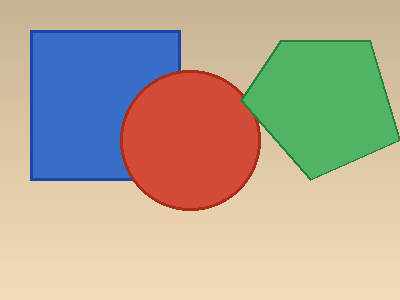
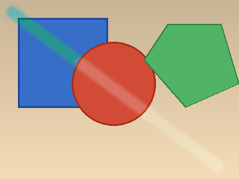
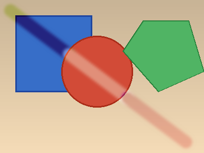
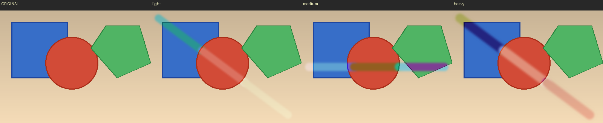

# Quantum Decoherence Brush

> *Every real quantum computer is slowly losing its mind. This brush makes that visible.*

When you paint with this brush, your stroke colors dissolve — not randomly, but through the exact two noise channels that limit every real NISQ device today. **Amplitude damping (T1)** pulls colors toward an environment bath. **Phase damping (T2)** scrambles their hue independently, without touching the brightness. Together, they turn a single brushstroke into a visual record of quantum memory fading away.

---

## How it works

When you drag a stroke, the brush divides the path into segments. Each segment samples the colors underneath it and computes a single representative color. That color gets encoded as a **qubit state on the Bloch sphere** — hue becomes the azimuthal angle φ, lightness becomes the polar angle θ:

```
φ = 2π · circmean(hue)    →  qc.ry(θ, i) then qc.rz(φ, i)
θ = π  · mean(lightness)
```

Your chosen **Environment Color** is encoded the same way, onto an ancilla qubit that represents the thermal bath.

Then the decoherence circuit runs. It couples each color-qubit to the environment ancilla over several Trotter steps, applying T1 and T2 noise incrementally. After the circuit finishes, the brush measures ⟨X⟩, ⟨Y⟩, ⟨Z⟩ for each qubit, reconstructs the new Bloch angles, and uses the angular shifts to update the hue and lightness of every pixel in that segment. The result gets blended with the original canvas according to **Strength**.

---

## The physics behind the circuit

### T1 — Amplitude damping

T1 is the time it takes for an excited qubit to release its energy to the environment and relax toward equilibrium. On the Bloch sphere, this shows up as the state vector contracting toward a fixed point — whichever state the environment "wants" the qubit to be in.

The brush implements T1 using an ancilla-coupling approach based on the Stinespring dilation. For each qubit and each Trotter step:

```python
amp_rotation = 2 * arccos(1 - per_step_amp)

qc.cry(amp_rotation, target=ancilla, control=qubit_i)  # partial energy transfer to bath
qc.cx(target=qubit_i, control=ancilla)                 # bath feeds back into qubit
qc.cry(per_step_amp * env_θ, target=qubit_i, control=ancilla)
qc.crz(per_step_amp * env_φ, target=qubit_i, control=ancilla)
```

The `CRY + CX` pair is the Stinespring unitary that produces the Kraus map for amplitude damping when you trace out the ancilla. The final `CRY/CRZ` rotations steer the relaxation toward your chosen **Environment Color** rather than the default |0⟩ ground state — which is what makes this a generalized thermal bath rather than just energy loss to zero.

**Visually:** colors drift toward the bath color. Like a photograph left in sunlight, they slowly forget what they were and settle toward the environment.

### T2 — Phase damping

T2 is faster and stranger than T1. It destroys the *phase* of a quantum state — the off-diagonal coherences in the density matrix — without necessarily changing the energy at all. The qubit gradually loses track of where it is around the Bloch sphere equator, even while its north–south position stays the same.

In the brush, each Trotter step applies a small RZ rotation to accumulate phase drift:

```python
qc.rz(per_step_phase * π, qubit_i)
```

This is a deterministic approximation of stochastic dephasing — it captures the same net angular shift in the ⟨X⟩, ⟨Y⟩ expectation values that random phase noise would produce on average.

**Visually:** hue shifts and smears along the stroke, independently of lightness. At high Phase Rate you can get strong color rotations — blues become purples, reds become oranges — while the brightness of the stroke stays intact.

### Trotterization — why take multiple steps?

Instead of applying the full T1 and T2 at once, the brush applies them in small, interleaved increments:

```
for step in range(Steps):
    apply T1 increment to each qubit
    apply T2 increment to each qubit
```

This is a Trotterized Lindbladian evolution — the same technique used in quantum simulation to approximate continuous-time evolution with discrete gate sequences. More steps means each increment is smaller and more accurate; it also means colors evolve further into the decoherence regime. With fewer steps and high rates, you get abrupt jumps. With many steps and lower rates, the color change feels more gradual and continuous.

### Reading the result

After the circuit runs, three Pauli observables are measured for each qubit:

```
⟨X⟩, ⟨Y⟩, ⟨Z⟩  →  φ_new = arctan2(⟨Y⟩, ⟨X⟩)
                    θ_new = arctan2(√(⟨X⟩² + ⟨Y⟩²), ⟨Z⟩)
```

This reconstructs the Bloch vector position without needing full state tomography. The difference between the old and new angles (Δφ, Δθ) is then applied as an HLS offset to all the pixels in that path segment, and blended with the original using **Strength**.

---

## Why a classical brush can't do this

There are two things this brush does that have no classical equivalent.

**Bloch sphere contraction.** When you apply amplitude damping and trace out the ancilla, the Bloch vector gets shorter — |⟨X⟩² + ⟨Y⟩² + ⟨Z⟩²| < 1. This is the signature of a mixed quantum state, and it cannot come from any unitary operation or any classical color manipulation. It only happens because information genuinely flows from the qubit into the environment.

**Curved color trajectories from entanglement.** The `CRY + CX` coupling temporarily entangles each color-qubit with the ancilla. This creates a color evolution path on the Bloch sphere that is curved and environment-dependent — not a straight interpolation toward the target, but a trajectory shaped by the quantum correlations between system and bath. Different environment colors produce qualitatively different paths, not just different endpoints.

---

## Parameters

| Parameter | What it controls physically | What you see |
|-----------|----------------------------|--------------|
| **Radius** | Brush footprint and number of path segments (= qubits) | Stroke width and color granularity |
| **Amplitude Rate** | T1 coupling strength γ per Trotter step | Colors fade toward the Environment Color |
| **Phase Rate** | T2 dephasing rate λ per Trotter step | Hue rotates and smears along the stroke |
| **Steps** | Trotter depth — how far the evolution runs | How deep into the decoherence regime |
| **Environment Color** | The thermal bath equilibrium state | The color the stroke slowly forgets toward |
| **Strength** | Blend between original and quantum-evolved pixels | How much the decoherence overrides the canvas |

T1 and T2 are completely independent parameters here, just as they are on real hardware. You can have strong energy loss with almost no dephasing, or heavy phase scrambling with barely any energy change — two very different visual effects from the same physical picture.

---

## Screenshots

| Before | Light decoherence (T1=0.2, T2=0.1) | Heavy decoherence (T1=0.9, T2=0.8) |
|--------|-------------------------------------|--------------------------------------|
|  |  |  |



---

## Why I made this

Most brushes in this collection model quantum algorithms — Heisenberg spin evolution, VQE chemistry, quantum drops. They're about what quantum computers *do*.

This one is about what they *can't escape*. Decoherence isn't a side effect you can patch away; it's the fundamental reason we're still in the NISQ era. T1 and T2 are the first two numbers reported for any new qubit — they define what's possible before anything else is considered. I wanted to make a brush that didn't treat decoherence as an enemy to suppress, but as a physical process worth rendering directly.

The two-channel structure gives you something you can't get from a single noise model: **two independent dimensions of forgetting**. T2 scrambles the hue — the *identity* of the color — before T1 has time to drain the energy. At high T2, low T1, you get chromatic chaos on a stable brightness background. At high T1, low T2, you get clean fade with the hue mostly intact. These aren't just visual variations; they correspond to genuinely different physical regimes that quantum engineers spend real effort distinguishing.

The result is a brush for painting impermanence. Strokes that don't stay. Colors that remember where they came from, but only partially, and for a limited time.

---

## References

**Open-system quantum mechanics and noise channels**
- Nielsen & Chuang, *Quantum Computation and Quantum Information* (2000), Chapter 8: Quantum noise and quantum operations — the foundational text for Kraus operators, amplitude damping, and Stinespring dilation.
- Preskill, *Lecture Notes on Quantum Computation*, Ch. 3: Foundations II — Measurement and Evolution — [preskill.caltech.edu/ph229](https://preskill.caltech.edu/ph229/) ([PDF](https://preskill.caltech.edu/ph229/notes/chap3.pdf)) — T1/T2 definitions, Bloch sphere geometry, quantum channels.

**NISQ-era context**
- Preskill, *Quantum Computing in the NISQ Era and Beyond* (2018) — [arXiv:1801.00862](https://arxiv.org/abs/1801.00862) — why coherence times are the central constraint on near-term hardware.
- Krantz et al., *A Quantum Engineer's Guide to Superconducting Qubits* (2019) — [arXiv:1904.06560](https://arxiv.org/abs/1904.06560) — how T1 and T2 are actually measured and what limits them in practice.

**Trotterization**
- Childs et al., *A Theory of Trotter Error* (2021) — [arXiv:1912.08854](https://arxiv.org/abs/1912.08854) — theoretical basis for the interleaved step decomposition used in the circuit.

**Color–quantum state mapping**
- Bloch sphere color encoding follows `color_to_spherical` in `effect/utils.py`: hue → azimuthal angle φ, lightness → polar angle θ.
- Circular mean for hue: Fisher, *Statistical Analysis of Circular Data* (1993) — the correct way to average an angular quantity like hue across a region.

**Quantum Brush**
- Park, *QuantumBrush* (2025) — [arXiv:2509.01442](https://arxiv.org/abs/2509.01442) — the paper this brush contributes to.
- Circuit structure and Pauli estimator pattern adapted from `effect/damping/`, `effect/qdrop/`, and `effect/heisenbrush/`.

---

## License

Apache License 2.0 — same as the Quantum Brush project.
