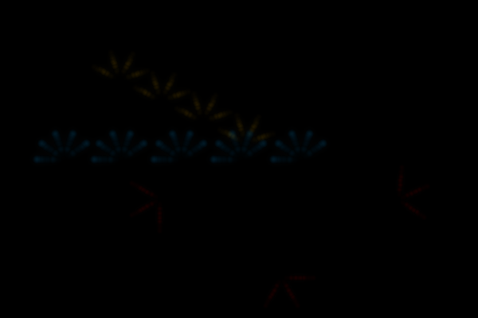

# Quantum Fracture

**A crystalline fracture brush powered by discrete-time quantum walks.**

---

## What it looks like



Three example strokes on a dark canvas:
- **Blue** (low Measurement Rate) - sharp, crystalline arms; classic quantum walk pattern
- **Gold** (medium Measurement Rate) - intermediate, jagged fractures
- **Red** (high Measurement Rate) - soft, diffuse spread; approaches classical random walk

---

## How it works

### The quantum physics

The Quantum Fracture brush is built on a **discrete-time quantum walk (DTQW)** - the quantum analogue of a classical random walk, and one of the central primitives in quantum computing and quantum information theory.

#### Classical random walk vs. quantum walk

In a classical random walk, a particle flips a fair coin each step and moves left or right. After *N* steps, its position follows a **Gaussian** (bell-curve) distribution with standard deviation √N - the particle diffuses outward slowly.

In a quantum walk, the "coin" is a **qubit** prepared in superposition |+⟩ = (|0⟩ + |1⟩)/√2 and the particle moves into a superposition of left and right simultaneously. Crucially, **quantum interference** between these paths produces a very different distribution:

```
Classical after 20 steps:   🔔  (Gaussian, σ ≈ √20 ≈ 4.5 px)
Quantum after 20 steps:     ⟨🔷⟩  (two sharp peaks at ±14 px)
```

The quantum walk spreads **quadratically faster** (σ ∝ N instead of √N) and leaves a sharp "crystalline" fingerprint - exactly the look of a glass crack or mineral fracture.

#### Circuit structure

For `steps = N`, the brush builds a Qiskit circuit with:
- **1 coin qubit** (Hadamard gate as the "quantum coin")
- **⌈log₂(2N+2)⌉ position qubits** (binary-encoded, two's-complement)

Each step:
1. Apply **Hadamard** to the coin qubit
2. **Controlled increment** of position register when coin = |1⟩
3. **Controlled decrement** when coin = |0⟩
4. Optionally, **measure the coin** mid-circuit with probability `p` (and reinitialise it to |+⟩)

The final circuit is simulated with Qiskit Aer's `AerSimulator` in shot-based mode (1024 shots), and the resulting **count histogram** is converted to a probability distribution over positions.

#### Measurement-induced phase transition (MIPT)

The key innovation is inserting **mid-circuit measurements** at a user-controlled rate `p` ("Measurement Rate"). This mimics a **measurement-induced phase transition** - a phenomenon actively studied in quantum error correction and many-body physics:

| Measurement Rate | Quantum behaviour | Visual result |
|-----------------|-------------------|---------------|
| `p = 0` | Fully coherent: interference intact | Sharp, long crystalline arms |
| `p ≈ 0.3` | Mixed: partial decoherence | Jagged, glassy fractures |
| `p = 1` | Fully classical: coin collapses every step | Soft, diffuse spread |

This isn't just a simulation trick - in real quantum hardware, mid-circuit measurements are an active area of research for preparing complex quantum states and studying entanglement transitions.

---

### Visual mapping

Each fracture **arm** traces the DTQW probability distribution:
- The **alpha** (opacity) of each pixel equals the quantum probability P(x) at that position
- **Lightness** is also modulated by P(x): core of the arm is bright, fringe is dim
- **Hue** comes from the user's chosen Colour parameter
- The `Branches` parameter controls how many arms radiate from each spine point
- With **Glow** enabled, a Gaussian-blurred aura is composited underneath - simulating the luminous halo of a laser refracted through crystal

The result: each brush stroke is a unique quantum outcome. No two strokes look the same.

---

## Parameters

| Parameter | Type | Range | Effect |
|-----------|------|--------|--------|
| **Radius** | int | 1–30 | Thickness of each fracture arm |
| **Branches** | int | 2–8 | Number of arms per spine point |
| **Measurement Rate** | float | 0.0–1.0 | Decoherence: 0 = quantum, 1 = classical |
| **Colour** | color | — | Base hue of the fracture |
| **Glow** | bool | — | Add luminous aura around arms |

---

## Usage tips

- **Low Measurement Rate (0.05–0.2)** + **high Branches (6–8)**: creates a star-burst / snowflake crystal
- **Medium Measurement Rate (0.3–0.5)** + **medium Branches (3–4)**: mimics broken glass or rock fractures
- **High Measurement Rate (0.7–1.0)** + **small Radius (2–3)**: soft frost or ice crystals
- Layer multiple strokes with complementary colours for stained-glass effects
- Dark canvases show the glow best; try deep navy or black backgrounds

---

## Why quantum walks for art?

Classical brushes blend colours smoothly. Quantum brushes create **interference patterns** - the same mathematics that gives quantum computers their computational power also gives quantum fractures their otherworldly geometry.

The two-peak distribution of the DTQW is genuinely impossible to replicate with any classical random process. When you paint with Quantum Fracture, you are looking at a visual signature of quantum mechanics itself: superposition creating structure that classical probability cannot.

---

## Technical notes

- Circuits are kept small (≤20 steps) to keep simulation fast on CPU
- The brush uses Qiskit Aer's shot-based simulator (not statevector) so results have quantum-style sampling noise - making each stroke subtly unique
- Alpha compositing blends the fracture over the existing canvas without erasing prior work
- The scipy gaussian_filter for glow degrades gracefully if scipy is unavailable